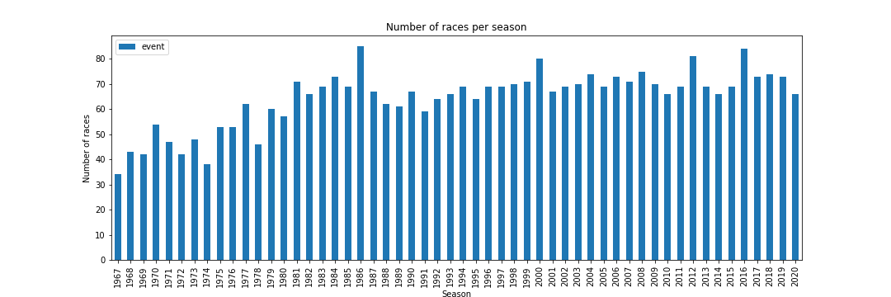
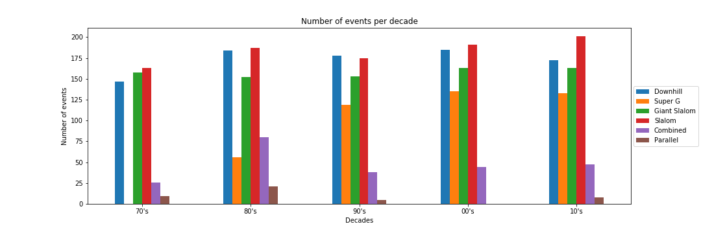

# Project of Data Visualization (COM-480)

| Student's name               | SCIPER |
| ---------------------------- | ------ |
| Beuchat Bastien              | 257117 |
| Jollès Eric Michel Alexandre | 269708 |
| Mamie Robin Georges Francis  | 257234 |

[Milestone 1](#milestone-1-friday-3rd-april-5pm) • [Milestone 2](#milestone-2-friday-1st-may-5pm) • [Milestone 3](#milestone-3-thursday-28th-may-5pm)

## Milestone 1 (Friday 3rd April, 5pm)

#### 10% of the final grade

### 1.1 Dataset

Our work will focus on the international ski federation (FIS, *fédération internationale de ski*) alpine skiing (AS) world cup (WC) results for both men and women, from 1966 until 2020.

The data is direcly extracted from [Ski-DB](https://www.ski-db.com/).
This site provides all results of every AS-WC race, following the data found directly on the [FIS website](https://www.fis-ski.com/DB/general/calendar-results.html?eventselection=results&sectorcode=AL&categorycode=WC).
We preferred using the former site rather than the latter for the [scraping part](/parser/parser.ipynb); indeed, the first site has a simpler layout that allows for easier work on the data, while remaining clean and exact.
You can see the manual corrections in the notebook.
All the data is already present in our repository - for both [men](/data/wcm.csv) and [women](/data/wcf.csv).

An example entry:

| season | date | venue | country | event | ath_rank | ath_name | ath_country | ath_time_run_1 | ath_time_run_2 | ath_time | ath_time_diff | ath_ski | ath_id |
| --- | --- | --- | --- | --- | --- | --- | --- | --- | --- | --- | --- | --- | --- |
| 2020 | 2020-01-12 | Adelboden | SUI | Slalom | 1 | Daniel Yule | SUI | 5315 | 5558 | 10873 | 0 | Fischer | daniel_yule_sui_511996 |

An entry is uniquely indexable using the *gender*, the *date* of the race, its *event type* (Slalom, Downhill, etc.) and the *name* of the athlete.
If a run was cancelled for one reason or another, it is still present with a (unique) blank athlete name.
The times are in hundredth of seconds to keep them as integers.
Times taken for the 1st and 2nd runs (for relevant events) always equal the total time.
`ath_diff` refers to the time difference w.r.t the race winner.
The `ath_ski` column refers to the ski brand used by the athlete, if the data exists.
The `ath_id` links back to the [athlete's profile](https://ski-db.com/db/profiles/daniel_yule_sui_511996.php) on Ski-DB, which provides additional information (birthdate, etc.)

### 1.2 Problematic

We want to explore the evolution of the FIS AS-WC.
Since its opening season in 1966, a lot of evolution has taken place in alpine skiing.
Indeed, the sport has evolved over the years.
It has grown to now have several kind of events all around the world.
With our historical dataset, we would like to visualize:

- The results of all ski races over the years.
- Skier profiles (i.e. in which events they participated) and their evolution through the years.
- The geographical representation of the WC races (here is a demo [ski map](https://com-480-project-data-viz-le-6.github.io/ski_map/)).
- The evolutive global ranking through seasons, using WC-points won by the athletes.
- Direct comparisons between any skier/races of any era.
- The evolution of the typical profile (age, type of events, etc.) of a race/World Cup winner.
- Race times over events and years: is there any correlation?

The web is full of sports-related visualizations, but almost nothing exists for skiing in general.
With our project, we plan on filling this gap by providing fans and enthusiasts a complete visualization of the AS-WC over the years, full with interesting developments and insights.

### 1.3 Exploratory data analysis

We scraped the data from the women and men world cup and we get those entities:

- Number of seasons: 54   (all seasons since the beginning of the WC)
- Number of races: 3477
- Number of athletes: 3137
- Number of countries: 77

Plotting the number of races per season shows that the ski world cup evolved and is still evolving during the recent years.
The number of races growed during the first 10 seasons but still continue to fluctuate as new event and new ephemeral locations are added to and removed from the FIS calendar.

Distribution of AS events for both genders, per decade, from 1970 to 2019:

### 1.4 Related work

There is data available for results, rankings and athletes profiles, but all are static tables not really reader-friendly and some basic static charts.
We did not find something similar to what we want to do.
We would like to create dynamic visualizations that smoothly explore our data.

- https://www.fis-ski.com : the FIS records all results, rankings and athlete information since the beginning of the AS-WC competitions (and various other sports).
- https://www.ski-db.com/ : the website on which we scraped the data also shows cool stats and rankings.
  For example: all time greatest ranking.
- http://ski-reference.com/ : a website that allows to query FIS website to compare two athletes or analyse the results of one run.
  It unfortunately does not work for old races (60s-90s).
- https://openaccess.city.ac.uk/id/eprint/19857/ : State of the Art of Sports Data Visualization.
  Paper with numerous sports-related visualizations.
- https://github.com/INRIA/atable : visualization of football league rankings.
## Milestone 2 (Friday 1st May, 5pm)

#### 10% of the final grade

## Milestone 3 (Thursday 28th May, 5pm)

#### 80% of the final grade
